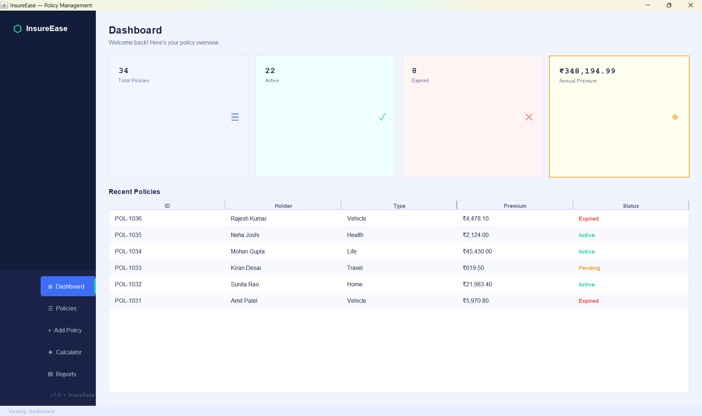
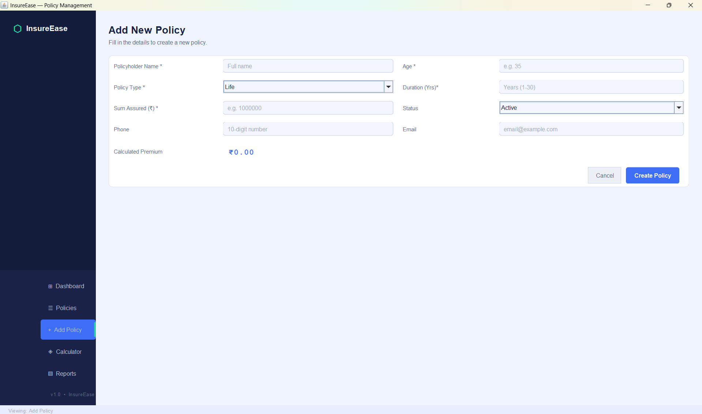
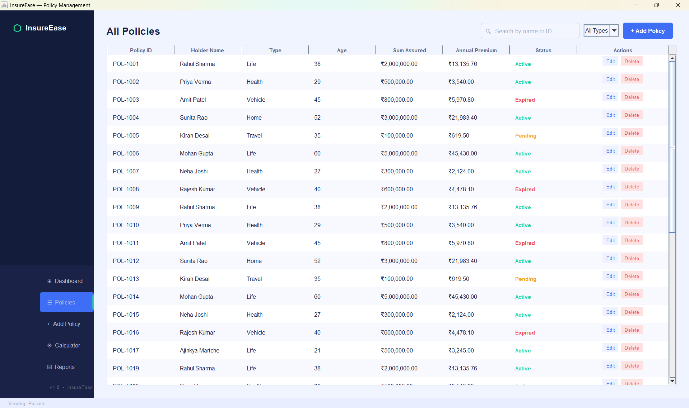
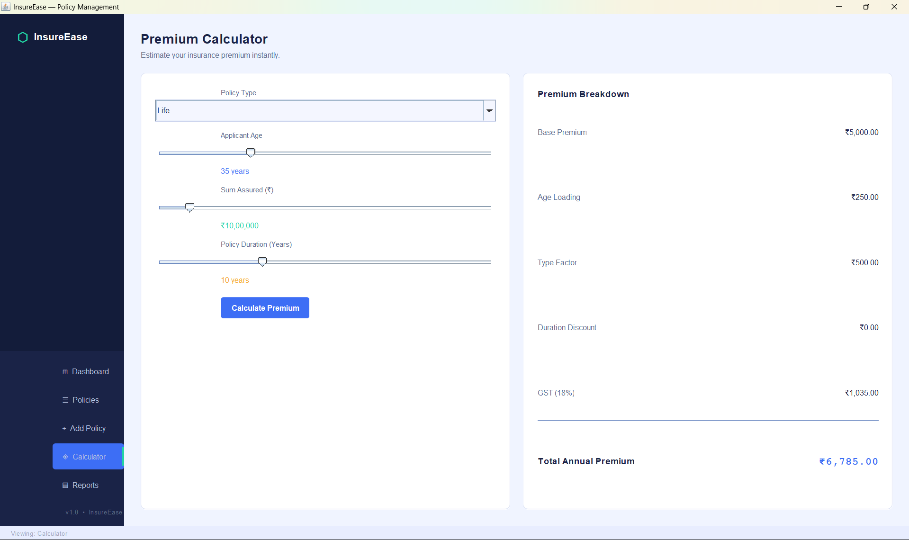
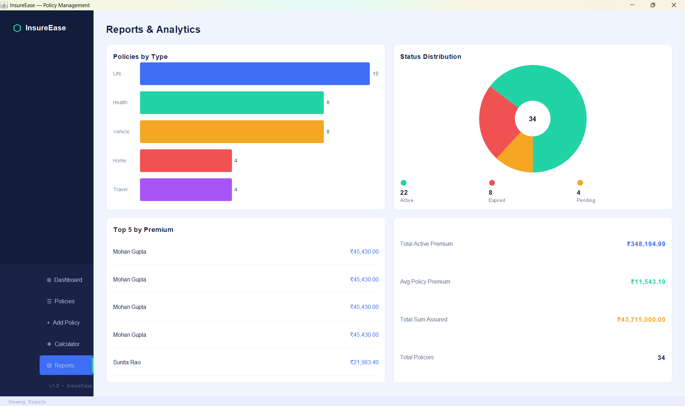

# 🛡️ Insurance Policy Management System

A desktop-based Insurance Policy Management System developed using **Java Swing** that enables users to manage insurance policies, calculate premiums, track policy details, and generate reports through an intuitive graphical user interface.

## 📌 Overview

The Insurance Policy Management System simplifies the process of handling insurance records by providing a centralized platform for policy management. Users can add, update, delete, and search policies while also analyzing policy data through reports and premium calculations.

This project demonstrates the implementation of Java GUI development, file handling, CRUD operations, and data management concepts.

---

## ✨ Features

### 📊 Dashboard

* Overview of insurance policies
* Quick access to system functionalities
* User-friendly navigation

### ➕ Add Policies

* Add new insurance policies
* Store policyholder details
* Record policy information efficiently

### 📋 Policy Management

* View all policies in a structured table
* Search and filter policies
* Update existing policy information
* Delete policies when required

### 💰 Premium Calculator

* Calculate insurance premiums
* Automate premium estimation
* Reduce manual calculation errors

### 📈 Reports & Analytics

* Generate policy reports
* Analyze insurance data
* View policy statistics and summaries

### 💾 Data Storage

* CSV-based data persistence
* Easy data management and portability

---

## 🛠️ Tech Stack

| Technology                  | Purpose                        |
| --------------------------- | ------------------------------ |
| Java                        | Core Programming Language      |
| Java Swing                  | GUI Development                |
| AWT                         | Event Handling & UI Components |
| CSV Files                   | Data Storage                   |
| Object-Oriented Programming | Application Design             |

---

## 📂 Project Structure

```text
InsurancePolicyManagement/
│
├── InsuranceApp.java
├── policies.csv
│
├── screenshots/
│   ├── dashboard.png
│   ├── add-policies.png
│   ├── policies.png
│   ├── premium-calculator.png
│   └── reports-&-analytics.png
│
└── README.md
```

---

## 🚀 How to Run

### Prerequisites

* Java JDK 8 or higher
* Command Prompt / PowerShell

### Clone Repository

```bash
git clone https://github.com/Ajinkya7890/InsurancePolicyManagement.git
cd InsurancePolicyManagement
```

### Compile the Application

```bash
javac InsuranceApp.java
```

### Run the Application

```bash
java InsuranceApp
```

---

## 📸 Application Screenshots

### Dashboard



### Add Policies



### Policy Management



### Premium Calculator



### Reports & Analytics



---

## 🎯 Learning Outcomes

Through this project, I gained practical experience in:

* Java Swing GUI Development
* Event-Driven Programming
* Object-Oriented Programming (OOP)
* CRUD Operations
* Data Persistence using CSV Files
* Desktop Application Development
* User Interface Design

---

## 🔮 Future Enhancements

* Database Integration (MySQL/PostgreSQL)
* User Authentication System
* Policy Renewal Notifications
* PDF Report Generation
* Advanced Analytics Dashboard
* Cloud-Based Data Storage

---

## 👨‍💻 Author

**Ajinkya Mariche**
**Shrenik Nil**

* B.Tech CSE (Data Science)
* St. Vincent Pallotti College of Engineering & Technology
* GitHub: https://github.com/Ajinkya7890

---

## 📜 License

This project is developed for educational and learning purposes.
